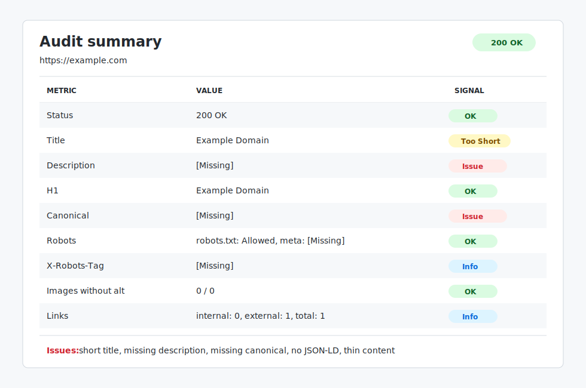

# SEO Auditor

Go-сервіс для етичного технічного SEO-аудиту сайтів. Застосунок читає чергу URL з PostgreSQL, паралельно перевіряє сторінки, дотримується `robots.txt`, збирає SEO-метрики та зберігає результат у базу даних.

Основний локальний runtime: **Docker Compose**.

## Можливості

- Конкурентний worker pool з керованою кількістю goroutine через `WORKERS`.
- Потокове читання URL через keyset pagination і bounded channels без завантаження всієї черги в RAM.
- Таймаути для PostgreSQL, HTTP-запитів, `robots.txt` і запису результатів.
- Двофазне graceful shutdown: припинення планування, завершення in-flight задач і примусове скасування за timeout.
- Обмеження максимального розміру HTML-відповіді для захисту від resource exhaustion.
- Базовий SSRF hardening: локальні та приватні IP-цілі заблоковані за замовчуванням.
- Маскування чутливих query-параметрів URL у логах, помилках і збережених результатах.
- Етичне сканування з per-host rate/concurrency control, bounded robots cache і підтримкою `Retry-After`.
- RFC 9309 access handling: до п'яти redirect, fail-closed для network/5xx помилок і allow для unavailable 4xx.
- Строга перевірка MIME type через `mime.ParseMediaType` і декодування HTML charset перед аналізом DOM.
- Структуровані JSON-логи через `log/slog`.
- Correlation `run_id` у кожному log record, окремий lifecycle запуску в `audit_runs` і результати в `audit_results`.
- Обмежені HTTP/PostgreSQL retry з exponential backoff і full jitter для transient errors.
- Multi-stage Docker build з мінімальним runtime image.
- Non-root parser container з numeric UID/GID `10001:10001`.
- PostgreSQL healthcheck, локально прив'язаний порт, persistent volume і init SQL baked into the database image.
- Регресійні тести для HTML-парсингу, canonical URL, robots rules і URL validation.

## Архітектура

```text
Docker Compose
├── postgres
│   ├── image: seo-auditor-postgres:local
│   ├── volume: pgdata
│   ├── ordered SQL migrations baked from initdb/
│   └── healthcheck: pg_isready
└── parser
    ├── image: seo-auditor:local
    ├── waits for healthy PostgreSQL
    ├── reads active URLs from pages_to_scan
    ├── scans pages concurrently
    └── реєструє запуск в audit_runs і upserts метрики в audit_results
```

## Структура репозиторію

```text
.
├── .github/
│   └── workflows/
│       └── ci.yml
├── docs/
│   ├── audit-summary.svg
│   └── example-result.md
├── initdb/
│   ├── 01_init.sql
│   └── 02_audit_run_history.sql
├── .dockerignore
├── .env.example
├── .gitignore
├── docker-compose.yml
├── Dockerfile
├── Dockerfile.postgres
├── go.mod
├── go.sum
├── LICENSE
├── config.go
├── config_test.go
├── integration_test.go
├── main.go
├── main_test.go
├── politeness.go
├── politeness_test.go
├── retry.go
├── retry_test.go
├── robots_cache.go
└── README.md
```

## SEO-метрики

- Nullable HTTP status code, `scan_status`, stable error code/message, redirect flag і redirect target.
- `title`, `meta description` та автоматичний quality status.
- `H1` count і структура `H2-H6`.
- Canonical URL і self-canonical check.
- `meta robots`, `X-Robots-Tag` та окремий `robots_outcome`.
- Open Graph, Twitter Card, JSON-LD і viewport.
- Internal/external links.
- Image alt audit.
- Word count і duration.

## Приклад результату

Скорочений приклад аудиту одного тестового URL наведено у файлі [`docs/example-result.md`](docs/example-result.md).



## Конфігурація

Docker Compose читає локальний `.env`. Для нового середовища скопіюйте `.env.example` у `.env` і змініть пароль.

| Variable | Default | Purpose |
| --- | ---: | --- |
| `DB_USER` | `seo_user` | PostgreSQL user. |
| `DB_PASSWORD` | `change-me-locally` | Пароль PostgreSQL для локального запуску; змініть перед deployment. |
| `DB_NAME` | `seo_db` | PostgreSQL database name. |
| `DB_PORT` | `5432` | Local host port bound to `127.0.0.1`. |
| `DATABASE_URL` | set in `.env` | Connection string used by the parser container. |
| `RUN_ID` | generated | Необов'язковий UUID запуску; якщо відсутній, генерується криптографічно. |
| `WORKERS` | `3` | Кількість паралельних worker goroutines. |
| `LOG_LEVEL` | `INFO` | Мінімальний рівень JSON-логів: `DEBUG`, `INFO`, `WARN` або `ERROR`. |
| `HTTP_REQUEST_TIMEOUT` | `5s` | Таймаут основного HTTP-запиту. |
| `ROBOTS_TIMEOUT` | `3s` | Таймаут запиту до `robots.txt`. |
| `DB_CONNECT_TIMEOUT` | `5s` | Таймаут підключення до PostgreSQL. |
| `DB_FETCH_TIMEOUT` | `5s` | Таймаут читання черги URL. |
| `DB_WRITE_TIMEOUT` | `3s` | Таймаут запису одного результату. |
| `SHUTDOWN_TIMEOUT` | `25s` | Максимальний час для завершення in-flight задач і запису результатів після сигналу. |
| `URL_BATCH_SIZE` | `100` | Максимальна кількість URL, що читаються з PostgreSQL за один batch. |
| `MAX_HTML_BODY_BYTES` | `5242880` | Максимальний розмір HTML-відповіді. |
| `RATE_LIMIT_INTERVAL` | `500ms` | Мінімальний інтервал між HTTP-запитами до одного host. |
| `MAX_CONCURRENT_PER_HOST` | `1` | Максимальна кількість одночасних HTTP-запитів до одного host. |
| `ROBOTS_CACHE_TTL` | `1h` | TTL кешованої robots policy; дозволений максимум становить `24h`. |
| `ALLOW_PRIVATE_TARGETS` | `false` | Дозвіл на локальні та приватні IP-цілі. |
| `HTTP_MAX_RETRIES` | `2` | Кількість повторів idempotent HTTP-запиту після transient failure. |
| `DB_MAX_RETRIES` | `2` | Кількість повторів безпечної PostgreSQL-операції після transient failure. |
| `RETRY_BASE_DELAY` | `200ms` | Початкова межа exponential backoff. |
| `RETRY_MAX_DELAY` | `2s` | Максимальна межа retry delay без урахування `Retry-After`. |

Якщо явно задана змінна має некоректний формат або виходить за дозволені межі, parser завершується з exit code `1`. `DATABASE_URL` є обов'язковою і не має вбудованого пароля чи fallback DSN.

## Запуск через Docker Compose

```bash
cp .env.example .env
docker compose up --build
```

Parser є batch-сервісом: він завершується після обробки активної черги URL, а PostgreSQL продовжує працювати для перегляду результатів.
Помилки окремих URL зберігаються у `audit_results` і позначають запуск як `completed_with_errors`, але не перезапускають весь batch. Після `SIGTERM` parser завершує in-flight задачі в межах `SHUTDOWN_TIMEOUT`, фіксує запуск як `canceled` і повертає exit code `130`.

Для PostgreSQL volume, створеного до переходу на історію запусків, один раз застосуйте міграцію:

```powershell
Get-Content -Raw .\initdb\02_audit_run_history.sql | docker compose exec -T postgres sh -c 'psql -U "$POSTGRES_USER" -d "$POSTGRES_DB"'
```

Перегляд логів parser service:

```bash
docker compose logs parser
```

Повторний запуск parser service без перезапуску PostgreSQL:

```bash
docker compose up --build parser
```

Перегляд результатів:

```bash
docker compose exec postgres psql -U seo_user -d seo_db -c "SELECT run_id, url, status_code, scan_status, robots_outcome, error_code FROM audit_results ORDER BY created_at DESC LIMIT 10;"
```

Перегляд запусків аудиту:

```bash
docker compose exec postgres psql -U seo_user -d seo_db -c "SELECT id, status, total_urls, successful_urls, failed_urls, started_at, finished_at FROM audit_runs ORDER BY started_at DESC LIMIT 10;"
```

Перегляд невдалих задач останнього запуску:

```bash
docker compose exec postgres psql -U seo_user -d seo_db -c "SELECT run_id, url, error_code, error_message, created_at FROM audit_results WHERE scan_status = 'failed' AND run_id = (SELECT id FROM audit_runs ORDER BY started_at DESC LIMIT 1) ORDER BY created_at DESC;"
```

Зупинка стека зі збереженням даних:

```bash
docker compose down
```

Повне очищення разом із PostgreSQL volume:

```bash
docker compose down -v
```

Міграція створює UUID-запуски для legacy-результатів, переносить їх до `audit_results` і видаляє стару таблицю `seo_results` після успішного перенесення.

## Локальні перевірки

```bash
go mod verify
go test ./...
go test -race ./...
go test -tags=integration -run '^TestAuditPipelinePersistsResult$' ./...
go vet ./...
go build ./...
docker compose config
docker compose build
```

Додатково, якщо інструменти встановлені та сумісні з поточною версією Go:

```bash
staticcheck ./...
golangci-lint run
govulncheck ./...
gitleaks detect --source . --redact
```

## Production notes

- Значення з `.env.example` призначені для локального запуску; для deployment задавайте власні секрети.
- Docker Compose у цьому репозиторії є локальним runtime, а не production deployment. HA PostgreSQL, automated backup/restore, monitoring та secret manager мають надаватися deployment-платформою.
- Поточна observability-модель містить JSON logs, `run_id` і фінальні counters. Prometheus endpoint та distributed tracing потребують окремого довгоживучого control plane або collector deployment.
- `ALLOW_PRIVATE_TARGETS=false` залишайте стандартним значенням для публічного сканування.
- `Retry-After` для HTTP `429/503` застосовується per host і обмежується максимумом `5m`, щоб зовнішня відповідь не зупинила весь batch.
- PostgreSQL порт прив'язаний до `127.0.0.1`, тому база не відкривається назовні.
- `Dockerfile.postgres` уникає host bind mounts, тому stack працює і з remote Docker daemon у Minikube.
- Parser image запускається від numeric non-root user `10001:10001`.
- Compose resource limits (`cpus`, `mem_limit`) утримують локальний стек у прогнозованих межах.
- `SHUTDOWN_TIMEOUT` має залишатися меншим за Compose `stop_grace_period`.

## Ліцензія

Проєкт поширюється за ліцензією MIT. Деталі наведено у файлі `LICENSE`.
