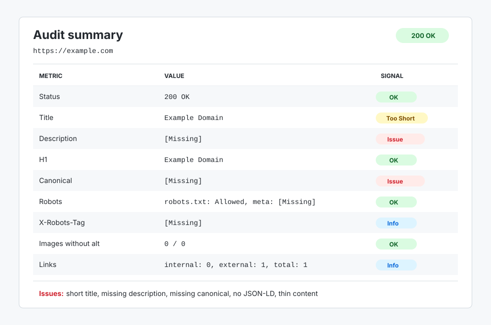

# SEO Auditor

Go-сервіс для етичного технічного SEO-аудиту сайтів. Застосунок читає чергу URL з PostgreSQL, паралельно перевіряє сторінки, дотримується `robots.txt`, збирає SEO-метрики та зберігає результат у базу даних.

Основний локальний runtime: **Docker Compose**.

## Можливості

- Конкурентний worker pool з керованою кількістю goroutine через `WORKERS`.
- Атомарна видача URL bounded batches через PostgreSQL `FOR UPDATE SKIP LOCKED`, target leases і bounded channels без завантаження всієї черги в RAM.
- Стабільний per-run snapshot targets із прямим `target_id` зв'язком між `audit_run_targets` та `audit_results`.
- Один активний owner для кожного `RUN_ID`: паралельний parser не може перехопити запуск, а після stale heartbeat той самий run відновлюється без повторної обробки завершених targets.
- Невалідні URL з snapshot не губляться в логах, а зберігаються як `failed` results з `error_code=invalid_target_url`.
- Версіоновані PostgreSQL migrations через `goose`: parser застосовує непройдені SQL-кроки на старті, веде `schema_migrations` і бере advisory lock.
- Таймаути для PostgreSQL, HTTP-запитів, `robots.txt` і запису результатів.
- Двофазне graceful shutdown: припинення планування, завершення in-flight задач і примусове скасування за timeout.
- Streaming HTML parser без `ReadAll`, DOM і повної копії body text; raw response обмежений до `8 MiB`, один tokenizer token — до `1 MiB`, а `WORKERS` перевіряється проти `96 MiB` parser heap budget.
- Базовий SSRF hardening: локальні та приватні IP-цілі заблоковані за замовчуванням.
- Маскування всіх query values URL у логах, помилках і `safe_url`; `target_fingerprint` лишається псевдонімізованим lookup-полем, а унікальність результатів тримається на `UNIQUE(run_id, target_id)`.
- Bounded storage для недовірених HTML metadata: oversized `title`, `H1`, canonical, Open Graph і robots values обрізаються до DB-safe меж із `*_truncated` та `*_original_length`.
- Етичне сканування з per-host rate/concurrency control, cache підготовлених robots policies до 64 hosts і підтримкою `Retry-After`.
- RFC 9309 access handling: до п'яти redirect, fail-closed для network/5xx помилок і allow для unavailable 4xx.
- Строга перевірка MIME type через `mime.ParseMediaType` і потокове декодування HTML charset перед tokenization.
- Структуровані JSON-логи через `log/slog`.
- Correlation `run_id` у кожному log record, окремий lifecycle запуску в `audit_runs` і результати в `audit_results`.
- Обмежені HTTP/PostgreSQL retry з exponential backoff і full jitter для transient errors.
- Multi-stage Docker build з мінімальним runtime image.
- Non-root parser container з numeric UID/GID `10001:10001`.
- PostgreSQL healthcheck, локально прив'язаний порт і persistent volume для локального runtime.
- Регресійні тести для HTML-парсингу, canonical URL, robots rules і URL validation.

## Архітектура

```text
Docker Compose
├── postgres
│   ├── image: seo-auditor-postgres:local
│   ├── volume: pgdata
│   └── healthcheck: pg_isready
└── parser
    ├── image: seo-auditor:local
    ├── waits for healthy PostgreSQL
    ├── applies embedded goose migrations with schema_migrations
    ├── materializes a stable per-run target set in audit_run_targets
    ├── claims targets atomically with bounded leases
    ├── scans pages concurrently
    └── реєструє запуск в audit_runs і upserts метрики в audit_results
```

Код розділено за межами відповідальності: `main.go` відповідає за lifecycle, shutdown і orchestration; `internal/config` ізолює runtime configuration та fail-fast validation; `internal/crawler` містить URL normalization, transport-level SSRF guard і HTTP client primitives; `internal/robots` відповідає за robots.txt path matching; `internal/seo` витягує HTML/SEO метрики. PostgreSQL boundary винесено з entrypoint у `audit_storage.go`, `audit_targets.go`, `audit_results.go` і `migrations.go`: ці файли відповідають за lifecycle запусків, snapshot цілей, persistence результатів і schema migrations.

## Структура репозиторію

```text
.
├── .github/
│   └── workflows/
│       └── ci.yml
├── docs/
│   ├── audit-summary.svg
│   └── example-result.md
├── initdb/
│   ├── 001_initial.sql
│   ├── 002_audit_run_history.sql
│   ├── 003_stable_targets_and_fingerprints.sql
│   ├── 004_url_retention_and_key_rotation.sql
│   ├── 005_storage_truncation_metadata.sql
│   ├── 006_run_heartbeat_and_target_progress.sql
│   ├── 007_target_leases_and_resume.sql
│   ├── 008_bounded_snapshot_finalization.sql
│   └── 009_target_start_tracking.sql
├── internal/
│   ├── config/
│   ├── crawler/
│   ├── robots/
│   └── seo/
├── .dockerignore
├── .env.example
├── .gitignore
├── docker-compose.yml
├── Dockerfile
├── Dockerfile.postgres
├── go.mod
├── go.sum
├── LICENSE
├── audit_models.go
├── audit_results.go
├── audit_stream.go
├── audit_targets.go
├── config.go
├── crawler_compat.go
├── config_test.go
├── integration_test.go
├── main.go
├── main_test.go
├── migrations.go
├── politeness.go
├── politeness_test.go
├── retry.go
├── retry_test.go
├── robots_cache.go
├── robots_compat.go
├── seo_compat.go
├── target_identity.go
├── worker.go
└── README.md
```

## SEO-метрики

- Stable `target_id` зв'язок із `audit_run_targets`, `fingerprint_key_id`, nullable HTTP status code, `scan_status`, stable error code/message, redirect flag і redirect target.
- Truncation telemetry для bounded `VARCHAR` полів: `*_truncated` та `*_original_length`.
- `title`, `meta description` та автоматичний quality status.
- `H1` count і структура `H2-H6`.
- Canonical URL і self-canonical check.
- `meta robots`, `X-Robots-Tag` та окремий `robots_outcome`.
- Open Graph, Twitter Card, JSON-LD і viewport.
- Internal/external links.
- Image alt audit.
- Word count і duration.

## Приклад результату

Скорочений приклад аудиту одного тестового URL наведено у файлі [`docs/example-result.md`](docs/example-result.md).



## Конфігурація

Docker Compose читає локальний `.env`. Для нового середовища скопіюйте `.env.example` у `.env` і змініть пароль.

| Variable | Default | Purpose |
| --- | ---: | --- |
| `DB_USER` | `seo_user` | PostgreSQL user. |
| `DB_PASSWORD` | `change-me-locally` | Пароль PostgreSQL для локального запуску; змініть перед deployment. |
| `DB_NAME` | `seo_db` | PostgreSQL database name. |
| `DB_PORT` | `5432` | Local host port bound to `127.0.0.1`. |
| `DATABASE_URL` | set in `.env` | Connection string used by the parser container. |
| `RUN_ID` | generated | Необов'язковий UUID запуску; якщо відсутній, генерується криптографічно. |
| `WORKER_INSTANCE_ID` | generated | Необов'язковий ID parser instance для heartbeat і target claims. |
| `TARGET_FINGERPRINT_KEY` | set in `.env` | HMAC key для `target_fingerprint`; замініть локальний placeholder перед deployment. |
| `TARGET_FINGERPRINT_KEY_ID` | `default` | Non-secret identifier ключа fingerprint; змінюйте під час ротації HMAC key. |
| `WORKERS` | `3` | Кількість паралельних worker goroutines; разом із token limit перевіряється проти `96 MiB` estimated parser heap budget. |
| `GOMEMLIMIT` | `192MiB` | Soft memory limit Go runtime; залишає запас відносно container limit `256m`. |
| `LOG_LEVEL` | `INFO` | Мінімальний рівень JSON-логів: `DEBUG`, `INFO`, `WARN` або `ERROR`. |
| `HTTP_ATTEMPT_TIMEOUT` | `5s` | Таймаут однієї HTTP-спроби. |
| `HTTP_TOTAL_TIMEOUT` | `20s` | Загальний таймаут для всього URL-запиту разом із retry/backoff. |
| `ROBOTS_ATTEMPT_TIMEOUT` | `3s` | Таймаут однієї спроби отримати `robots.txt`. |
| `ROBOTS_TOTAL_TIMEOUT` | `10s` | Загальний таймаут для перевірки `robots.txt` разом із retry/backoff. |
| `DB_CONNECT_TIMEOUT` | `5s` | Таймаут підключення до PostgreSQL. |
| `DB_MIGRATION_TIMEOUT` | `30s` | Таймаут application-level PostgreSQL migrations і очікування migration lock. |
| `DB_FETCH_TIMEOUT` | `5s` | Таймаут читання стабільного набору URL. |
| `DB_WRITE_TIMEOUT` | `3s` | Таймаут запису одного результату. |
| `AUDIT_RUN_HEARTBEAT_INTERVAL` | `30s` | Інтервал оновлення `audit_runs.heartbeat_at` для активного parser instance. |
| `HEARTBEAT_FAILURE_THRESHOLD` | `3` | Кількість послідовних помилок heartbeat, після яких parser зупиняє scheduling і завершує run як `failed`. |
| `STALE_RUN_THRESHOLD` | `5m` | Running-запуски зі старішим heartbeat автоматично позначаються як `abandoned` на наступному startup. |
| `TARGET_LEASE_DURATION` | `2m` | Тривалість target claim; heartbeat продовжує leases активного owner. Має перевищувати heartbeat interval і сумарний robots/page request budget. |
| `SHUTDOWN_TIMEOUT` | `25s` | Максимальний час для завершення in-flight задач і запису результатів після сигналу. |
| `URL_BATCH_SIZE` | `100` | Максимальна кількість URL, що читаються з PostgreSQL за один batch. |
| `MAX_HTML_BODY_BYTES` | `5242880` | Максимальний розмір HTML-відповіді; абсолютна межа `8 MiB`. |
| `MAX_HTML_TOKEN_BYTES` | `524288` | Максимальний token buffer потокового HTML parser; абсолютна межа `1 MiB`. |
| `RATE_LIMIT_INTERVAL` | `500ms` | Мінімальний інтервал між HTTP-запитами до одного host. |
| `MAX_CONCURRENT_PER_HOST` | `1` | Максимальна кількість одночасних HTTP-запитів до одного host. |
| `ROBOTS_CACHE_TTL` | `1h` | TTL кешованої robots policy; дозволений максимум становить `24h`. |
| `ALLOW_PRIVATE_TARGETS` | `false` | Дозвіл на локальні та приватні IP-цілі. |
| `HTTP_MAX_RETRIES` | `2` | Кількість повторів idempotent HTTP-запиту після transient failure. |
| `DB_MAX_RETRIES` | `2` | Кількість повторів PostgreSQL-операції. Mutations повторюються лише після гарантованого rollback або помилки до відправлення запиту. |
| `RETRY_BASE_DELAY` | `200ms` | Початкова межа exponential backoff. |
| `RETRY_MAX_DELAY` | `2s` | Максимальна межа retry delay без урахування `Retry-After`; фактичне очікування також обмежується total budget. |

Якщо явно задана змінна має некоректний формат або виходить за дозволені межі, parser завершується з exit code `1`. `DATABASE_URL` і `TARGET_FINGERPRINT_KEY` є обов'язковими і не мають fallback-значень у коді.

## Запуск через Docker Compose

```bash
cp .env.example .env
docker compose up --build
```

Parser є batch-сервісом: він завершується після обробки стабільного набору URL, а PostgreSQL продовжує працювати для перегляду результатів.
Помилки окремих URL зберігаються у `audit_results` і позначають запуск як `completed_with_errors`, але не перезапускають весь batch. Після `SIGTERM` parser завершує in-flight задачі в межах `SHUTDOWN_TIMEOUT`, фіксує запуск як `canceled` і повертає exit code `130`.
Активний запуск регулярно оновлює `audit_runs.heartbeat_at` і `lease_until` виданих targets. Після трьох послідовних помилок heartbeat parser припиняє видачу нових задач, завершує in-flight роботу в межах `SHUTDOWN_TIMEOUT` і фіксує run як `failed`. Heartbeat зупиняється лише після запису terminal status. PostgreSQL атомарно видає лише `pending` або допустимі прострочені targets через `FOR UPDATE SKIP LOCKED`; claim batch обмежений кількістю workers і вільними місцями bounded queue. `attempts` та `started_at` оновлюються лише під час фактичного старту worker.
Стабільний snapshot читається keyset-порціями в одному `REPEATABLE READ` view, але записується окремими bounded batches. Resume, зміна terminal status і очищення `request_url` також виконуються ідемпотентними порціями: `DB_FETCH_TIMEOUT` та `DB_WRITE_TIMEOUT` обмежують одну SQL-операцію, а не весь набір URL.

Якщо heartbeat застарів після аварійного завершення, наступний startup позначає run як `abandoned`. Системна помилка persistence переводить run у `failed`, але залишає незавершені targets у `pending` разом із захищеним runtime payload. Повторний запуск із тим самим `RUN_ID` отримує ownership і продовжує за збереженим snapshot. Targets зі статусами `completed` і `failed` повторно не скануються. Поки попередній owner активний, другий parser із тим самим `RUN_ID` завершується з fatal configuration/runtime error до будь-яких HTTP-запитів.

Parser автоматично застосовує непройдені міграції з `initdb/` перед створенням нового `audit_run`. Для старих PostgreSQL volumes без `schema_migrations` застосунок ідемпотентно приймає наявну схему, доганяє її до поточної версії та завершується з exit code `1`, якщо схема новіша за підтримувану цим binary.

Raw target URL зберігається в `pages_to_scan`, бо це source input для crawler і має вважатися чутливими даними в довіреній PostgreSQL. Під час активного запуску raw URL тимчасово копіюється в `audit_run_targets.request_url`, але після завершення запуску parser очищає це поле. Логи й історичні результати використовують `safe_url`, де всі query values замасковані.

Перегляд логів parser service:

```bash
docker compose logs parser
```

Повторний запуск parser service без перезапуску PostgreSQL:

```bash
docker compose up --build parser
```

Перегляд результатів:

```bash
docker compose exec postgres psql -U seo_user -d seo_db -c "SELECT run_id, target_id, safe_url, fingerprint_key_id, status_code, scan_status, robots_outcome, error_code FROM audit_results ORDER BY created_at DESC LIMIT 10;"
```

Перегляд запусків аудиту:

```bash
docker compose exec postgres psql -U seo_user -d seo_db -c "SELECT id, status, worker_instance_id, heartbeat_at, total_urls, successful_urls, failed_urls, started_at, finished_at FROM audit_runs ORDER BY started_at DESC LIMIT 10;"
```

Перегляд прогресу targets останнього запуску:

```bash
docker compose exec postgres psql -U seo_user -d seo_db -c "SELECT target_id, status, attempts, claimed_by, claimed_at, started_at, lease_until, finished_at, last_error FROM audit_run_targets WHERE run_id = (SELECT id FROM audit_runs ORDER BY started_at DESC LIMIT 1) ORDER BY target_id LIMIT 20;"
```

Перегляд невдалих задач останнього запуску:

```bash
docker compose exec postgres psql -U seo_user -d seo_db -c "SELECT run_id, target_id, safe_url, error_code, error_message, created_at FROM audit_results WHERE scan_status = 'failed' AND run_id = (SELECT id FROM audit_runs ORDER BY started_at DESC LIMIT 1) ORDER BY created_at DESC;"
```

Зупинка стека зі збереженням даних:

```bash
docker compose down
```

Повне очищення разом із PostgreSQL volume:

```bash
docker compose down -v
```

`002_audit_run_history.sql` створює UUID-запуски для legacy-результатів, переносить їх до `audit_results` і видаляє стару таблицю `seo_results` після успішного перенесення. `003_stable_targets_and_fingerprints.sql` додає стабільний snapshot targets, `safe_url`, `target_fingerprint` і прямий `UNIQUE(run_id, target_id)` зв'язок. `004_url_retention_and_key_rotation.sql` очищає legacy query strings у result-полях, додає `fingerprint_key_id` і прибирає historical `request_url` для завершених запусків. `005_storage_truncation_metadata.sql` додає telemetry для HTML metadata, які були обрізані перед записом у bounded storage columns. `006_run_heartbeat_and_target_progress.sql` додає heartbeat запуску, `worker_instance_id` і status/attempt tracking для `audit_run_targets`. `007_target_leases_and_resume.sql` додає `lease_until`, стабільний marker фіксації snapshot і індекс атомарної видачі targets. `008_bounded_snapshot_finalization.sql` додає partial indexes для keyset snapshot capture та bounded очищення URL під час фіналізації. `009_target_start_tracking.sql` відокремлює час claim від фактичного `started_at`; нова спроба рахується тільки після старту worker.

## Локальні перевірки

```bash
go mod verify
go test ./...
go test -race ./...
go test -tags=integration ./...
go vet ./...
go build ./...
docker compose config
docker compose build
```

Додатково, якщо інструменти встановлені та сумісні з поточною версією Go:

```bash
staticcheck ./...
golangci-lint run
govulncheck ./...
gitleaks detect --source . --redact
```

## Production notes

- Значення з `.env.example` призначені для локального запуску; для deployment задавайте власні секрети.
- Docker Compose у цьому репозиторії є локальним runtime, а не production deployment. HA PostgreSQL, automated backup/restore, monitoring та secret manager мають надаватися deployment-платформою.
- Перед production upgrade робіть backup PostgreSQL volume/database; SQL migrations є forward-only, rollback має виконуватися через restore перевіреного backup або окремий rollback-план deployment-платформи.
- Поточна observability-модель містить JSON logs, `run_id` і фінальні counters. Prometheus endpoint та distributed tracing потребують окремого довгоживучого control plane або collector deployment.
- `ALLOW_PRIVATE_TARGETS=false` залишайте стандартним значенням для публічного сканування.
- `Retry-After` для HTTP `429/503` застосовується per host і обмежується максимумом `5m`; для конкретного URL очікування додатково обмежується залишком `HTTP_TOTAL_TIMEOUT` або `ROBOTS_TOTAL_TIMEOUT`.
- PostgreSQL порт прив'язаний до `127.0.0.1`, тому база не відкривається назовні.
- `Dockerfile.postgres` уникає host bind mounts; схему застосовує parser через embedded migrations, тому stack працює і з remote Docker daemon у Minikube.
- Parser image запускається від numeric non-root user `10001:10001`.
- Compose resource limits (`cpus`, `mem_limit`) утримують локальний стек у прогнозованих межах.
- `SHUTDOWN_TIMEOUT` має залишатися меншим за Compose `stop_grace_period`.

## Ліцензія

Проєкт поширюється за ліцензією MIT. Деталі наведено у файлі `LICENSE`.
