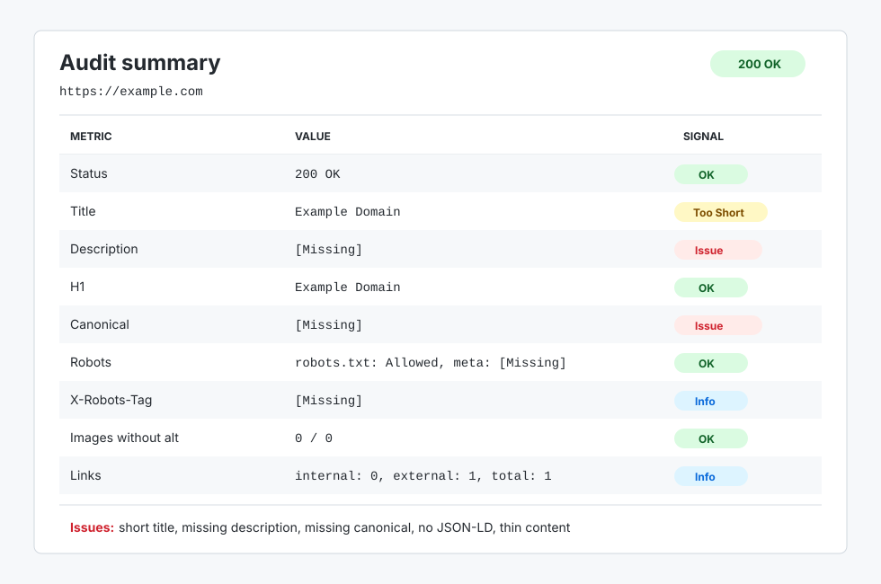

# SEO Auditor

Локальний браузерний інструмент технічного SEO-аудиту на Go. Вставте URL, запустіть перевірку та перегляньте повний звіт: HTTP-статуси, метадані, canonical, robots, контент, посилання, зображення та помилки. PostgreSQL залишається основним сховищем. Crawler дотримується `robots.txt`, обмежує ресурси та блокує приватні мережеві цілі за замовчуванням.

Основний локальний runtime: **Docker Compose**.

## Готовність до GEO: локальна версія

Режим **Готовність до GEO** (`/geo`) аналізує збережений SEO-аудит: зіставляє до **1000 запитів** із цільовими сторінками, показує прогалини, пояснює структурні сигнали та зберігає **ручні** спостереження щодо AI-цитувань. Зовнішні API, ключі SerpApi, LLM та платні запити не використовуються. Звичайні витрати на локальні ресурси залишаються.

1. Завершіть SEO-аудит потрібного сайту. Для повних нових сигналів потрібне сканування після цього оновлення.
2. Відкрийте **Готовність до GEO**, виберіть ідентифікатор завершеного аудиту, домен і, за потреби, бренд.
3. Додайте запити, по одному на рядок, та натисніть **Проаналізувати**.
4. У деталях запиту перевірте кандидатів, збіги термінів, докази, прогалини й застереження. Фільтри виділяють незнайдені сторінки, близьких кандидатів та неповні дані.
5. За потреби самостійно перевірте запит у Google AI Overviews, ChatGPT, Gemini чи Perplexity. Збережіть спостереження, посилання на доказ і нотатку. Це не автоматична перевірка видимості.
6. Експортуйте таблицю та ручні спостереження у CSV. PostgreSQL є основним сховищем.

### Що означають оцінки

- **Збіг термінів**: частка точних нормалізованих термінів запиту, знайдених у title, H1, описі, шляху URL, заголовках і текстовій вибірці. Службові та частина загальних слів вилучаються. Кандидат потребує ≥50% збігів. За рівності title/H1 мають більшу вагу, потім заголовки, опис і вибірка. Немає синонімів, лематизації, перекладу чи семантичної моделі; це не відсоток покриття інтенту.
- **Намір**: евристика за українськими й англійськими маркерами запиту; якщо маркерів немає, показується «Не визначено».
- **Готовність**: частка виявлених структурних сигналів. Перевіряються перший абзац із термінами, один H1, список або таблиця, позначення автора, зовнішні посилання, розпізнані типи JSON-LD. Для порівняльного запиту додається таблиця. ≥75% — сильні сигнали, ≥45% — часткові, нижче — слабкі. Невизначена JSON-LD не входить у знаменник. Це не Google-рейтинг і не прогноз цитування.
- Авторство не підтверджує експертності, посилання не підтверджує достовірності, таблиця не обов'язково є порівнянням. Рекомендації потребують редакторського рішення. FAQ, порівняння, ціни та посадкові сторінки не оголошуються обов'язковими для кожного запиту.
- Близькі кандидати та багато запитів на один URL — привід для ручного аналізу, не автоматичний доказ канібалізації. «Не знайдено» стосується лише вибраного набору успішних сторінок.

### Межі, дані та сумісність

Джерело має бути завершеним (`completed` / `completed_with_errors`) і містити не більше 1000 успішних HTTP 200 сторінок. Вибираються лише вказаний домен і його піддомени. Історія й вибір джерел показують останні 100 записів; давніше джерело можна вказати його UUID. Усі результати одного GEO-звіту доступні через пошук і пагінацію браузера. Запит обмежений 300 символами, весь список — 500 КБ, повтори вилучаються.

Під час звичайного розбору HTML додатково зберігаються: перші 2000 символів тексту, до 800 символів заголовків, до 600 символів першого абзацу, наявність списку/таблиці/авторства та розпізнані типи JSON-LD. Інертні `template`, `script` і `style` не включаються у текст; JavaScript і CSS-видимість не виконуються. Вибірка може включати навігацію. JSON-LD обмежено 64 КіБ на блок, 256 КіБ на сторінку та лімітами вузлів/глибини. Обрізана вибірка й неповна JSON-LD явно позначаються.

Міграція **`015_geo_readiness.sql`** додає nullable `audit_results.geo_signals` і окремі таблиці `geo_reports`, `geo_query_results`, `geo_citation_checks`. Старі міграції й SEO-результати не переписуються; старим результатам не вигадуються відсутні сигнали. Звіт створюється однією транзакцією зі стабільним знімком джерела. Advisory lock допускає один GEO-аналіз одночасно; повтор того самого UUID та вмісту повертає той самий звіт. Відмова або timeout відкочує незавершене створення, нового crawler-запуску немає. Видалення вихідного SEO-аудиту каскадно видаляє залежні GEO-звіти.

Ручне спостереження зберігає AI-систему, цитування/згадку («Так», «Не виявлено», «Не перевірено»), серверну дату, URL доказу й нотатку. Для кожної системи зберігається останній запис; це **не історичний моніторинг**. URL-параметри маскуються, довільні секрети у тексті автоматично не розпізнаються. Запити, вибірки контенту та нотатки залишаються в довіреній локальній БД: не вставляйте приватні токени або персональні дані. CSV нейтралізує формули; браузер відображає зовнішній текст через `textContent`.

API використовує той самий захист сесії та Origin:

- `GET /api/geo/sources`, `GET /api/geo/reports`.
- `POST /api/geo/reports`: `id` (новий UUID), `source_run_id`, `domain`, `brand`, `queries`.
- `GET /api/geo/reports/{id}`, `GET /api/geo/reports/{id}/export/csv`.
- `POST /api/geo/reports/{id}/queries/{ordinal}/citation`.

Ця версія не вимірює пошукові позиції, фактичну AI-видимість, цитованих конкурентів або зміни у часі. Інтеграції SerpApi та інших AI-систем не підключені.

## Швидкий старт Windows

Запустіть Docker Desktop, потім відкрийте **`start-auditor.cmd`**. Launcher створить `.env`, якщо його немає, з випадковими паролем PostgreSQL, HMAC-ключем і web access token. Наявні DB credentials не змінюються. Після `docker compose up -d --build --wait` відкриється браузер: **http://127.0.0.1:8080**.

1. Виберіть **Список URL** або **Site Crawl**. Для Site Crawl задайте стартовий URL, ліміт сторінок, глибину та використання sitemap.
2. Натисніть **Запустити аудит**. Прогрес оновлюється приблизно раз на секунду.
3. Перегляньте розподіли HTTP, SEO-сигналів, помилок, часу та кількості слів.
4. Відкрийте **Сторінки**: пошук URL, фільтри, вибір колонок і повні деталі кожного результату.
5. Завантажте повний **HTML** або **CSV**. Експорт не залежить від активного фільтра.

`stop-auditor.cmd` зупиняє стек без видалення volumes. Повторний `start-auditor.cmd` зберігає історію. Для іншого web-порту задайте `WEB_PORT` у `.env`; якщо локальний PostgreSQL уже займає порт, змініть `DB_PORT`. Дані іншого Compose project автоматично не переносяться.

Одночасно виконується один web audit. Скасування завершує поточні запити в межах існуючих shutdown/finalization budgets. Після аварії доступне відновлення за збереженим snapshot після stale threshold; завершені targets не скануються повторно. Свідомо скасований запуск не відновлюється.

Інтерфейс не є публічним SaaS: порт опублікований тільки на loopback. Launcher передає випадковий access token через URL fragment, який видаляється до API-запиту, та встановлює `HttpOnly; SameSite=Strict` session cookie. Якщо браузер показує відмову в доступі, знову запустіть launcher. Не публікуйте `.env` і не відкривайте container port у зовнішню мережу.

## Browser API та звіт

- `GET /healthz`, `GET /readyz`: стан процесу та PostgreSQL.
- `POST /api/session`: локальна browser session через bearer token.
- `GET /api/schema`: перелік дозволених report fields.
- `GET /api/audits`, `POST /api/audits`: історія та запуск `{ "urls": "https://example.com/\nhttps://example.com/about" }`.
- `GET /api/audits/{id}`, `/progress`, `/analytics`, `/results`.
- `GET /api/audits/{id}/graph`: пагінований граф Site Crawl, anchor texts, nofollow та результат перевірки destination.
- `POST /api/audits/{id}/cancel`, `/resume`: JSON `{}`.
- `GET /api/audits/{id}/export/html`, `/export/csv`: повний потоковий експорт завершеного run.

API потребує bearer token або session cookie. Змінюючі запити додатково потребують same-origin `Origin`, `Content-Type: application/json` та `X-SEO-Auditor-Request: 1`. Немає permissive CORS, зовнішніх assets, CDN або frontend build chain.

Таблиця використовує keyset cursor `after=target_id`, `limit=50` (максимум 200), `search` та whitelist `filter`. Історія: 50 запусків на сторінку й opaque cursor. POST body обмежений 8 MiB, `MAX_WEB_URLS_PER_RUN` має default/max 10000, один URL: 2048 символів. Метадані та telemetry `*_truncated`/`*_original_length` доступні у деталях. `request_url` і fingerprint не повертаються браузеру.

Агрегати обчислює PostgreSQL. HTML-сигнали рахуються для розібраних HTTP 200 сторінок, а HTTP/outcome distributions охоплюють усі результати. Title і Description оцінюються за шириною тексту в px, а кількість символів залишається окремою метрикою. Non-self canonical, відсутність JSON-LD, мала кількість слів і robots block не позначаються універсальними помилками. Noindex distribution показує наявність директиви в будь-якому scope, не остаточне рішення пошуковика.

### Оцінка SERP width

| Метрика | Ширина | Статус |
| --- | --- | --- |
| Title | ≤580 px | Recommended |
| Title | 581–600 px | Borderline |
| Title | >600 px | High truncation risk |
| Description | ≤680 px | Desktop: Safe; Mobile: Safe |
| Description | 681–920 px | Desktop: Safe; Mobile: May truncate |
| Description | >920 px | Desktop: May truncate; Mobile: Likely truncate |

Сервер використовує вбудований Liberation Sans 2.1.5: regular 20 px для Title та 14 px для Description, kerning без hinting, згортання whitespace та округлення ширини вгору до цілого CSS pixel. Це оцінка ризику, а не точна емуляція Google: пошуковик може переписати snippet, виділити слова жирним або змінити layout. Непідтримувані glyphs мають fallback шириною 1 em; `serp_width_approximate` також позначає підтримувані перевіркою випадки складного письма. Зовнішні шрифти та браузер для обчислення не потрібні; ліцензія OFL зберігається в `internal/seo/fonts/`.

Метрики обчислюються до storage truncation та зберігаються разом із версією моделі. Порожні метадані мають `Missing`, а нерозібрані сторінки не отримують pixel metrics. Міграція `012_serp_pixel_metrics.sql` не переписує історію: у старих рядках px дорівнює `NULL`, а character-based статус у звіті має префікс `Legacy:`. Для отримання px потрібен новий аудит. Значення та статуси однакові у web details, таблиці, CSV та HTML-експорті; `description_status` тепер означає Desktop, `description_mobile_status` — Mobile.

### Розмір HTML / Googlebot

`html_raw_bytes` вимірює фактично прочитані байти HTML після HTTP-розпакування (зокрема gzip), але **до** перетворення charset. Це не `Content-Length`, не розмір DOM і не обсяг усіх ресурсів сторінки. Safety limit `MAX_HTML_BODY_BYTES=8388608` залишається незалежним.

| Умова | `googlebot_2mb_status` |
| --- | --- |
| Повне HTML, менше 2 097 152 bytes | `OK` |
| Прочитано щонайменше 2 097 152 bytes | `Googlebot cutoff risk` |
| Неповне читання нижче порога | `Unknown (incomplete HTML)` |

`html_size_complete=false` означає, що байти є нижньою межею, а не повним розміром документа. Старі результати та відповіді без HTML-парсингу мають `html_raw_bytes=NULL`, без вигаданого `OK`. Міграція `013_html_size.sql` не перераховує історію. Метрика, фільтр ризику та агрегати доступні у браузері, CSV й HTML.

За [документацією Googlebot](https://developers.google.com/search/docs/crawling-indexing/googlebot), ліміт застосовується до uncompressed data; [пояснення Google](https://developers.google.com/search/blog/2026/03/crawler-blog-post) також враховує HTTP headers. Наш body-only поріг **2 MiB** є оцінкою ризику, не точною емуляцією всього fetch budget: `OK` не гарантує повного завантаження чи індексації Google. Ресурси CSS/JS мають окремі бюджети; PDF ця метрика не оцінює.

### Site Crawl

```json
{
  "mode": "site",
  "site": {
    "root_url": "https://example.com/",
    "max_pages": 100,
    "max_depth": 5,
    "use_sitemaps": true
  }
}
```

Надішліть цей JSON у `POST /api/audits` з тими самими auth/CSRF headers, що й для списку URL. Режим `run` з `pages_to_scan` залишається незмінним.

Обхід використовує початковий **origin** (scheme + нормалізований IDN hostname + port). Subdomains, інший scheme/port та cross-origin redirects не розширюють scope автоматично. Вони залишаються у графі як зовнішні посилання; за потреби запустіть окремий аудит правильного стартового URL. Query string зберігає семантику; fragments відкидаються, еквівалентні hostname/default ports нормалізуються. Різні signed URL не зливаються після redaction.

1. Завантаження robots policy через спільний fail-closed cache.
2. Пошук `Sitemap:` у robots.txt та fallback `/sitemap.xml`; підтримка XML `urlset`, `sitemapindex` і gzip. Кожен sitemap перевіряється за robots.txt; кожен redirect повторно проходить scope/robots/SSRF validation.
3. BFS від стартової сторінки: поточна frontier завершується лише після запису результатів та їхніх нових цілей. Sitemap-only seeds скануються після reachable frontier; від них також виконується bounded BFS. `<a href>` враховує `<base>`, anchor text та `rel=nofollow`. Nofollow edges зберігаються, але самі по собі не додають ціль до обходу.
4. Результат, завершення target, нові targets та вихідні edges записуються **в одній транзакції** під ownership fencing. Невдалий запис зупиняє планування; run можна відновити без втрати discovery. Одночасні повтори URL дедуплікуються за HMAC у межах запуску. Для resume потрібен початковий `TARGET_FINGERPRINT_KEY`; після його ротації слід почати новий site audit.
5. Після завершення обчислюється граф: shortest click depth від стартового URL (redirect = 0 додаткових кліків), унікальні вхідні сторінки / вихідні внутрішні URL, посилання на HTTP 4xx/5xx, внутрішні redirects, sitemap orphan candidates. Цикли не створюють нескінченний обхід.

**Межі:** UI defaults — 100 сторінок і 5 рівнів; hard limits — 1000 сторінок, 10 рівнів від root або sitemap seed, до 4 workers, 256 зібраних links на сторінку, 2048 bytes на discovery URL, 256 символів anchor. Redirect також витрачає рівень discovery, хоча не додає кліка до графа. Sitemap: до 16 файлів, 2 MiB decoded XML на файл, bounded XML nesting/token count, загальний discovery budget 2 хвилини; private-network доступ за замовчуванням заборонено. Ліміти фіксуються у `limit_reached`, `links_truncated`, `sitemap_state` і не приховуються як повний обхід. Якщо sitemap заповнює весь page budget, додаткові URL із HTML залишаються неперевіреними edges. Рекомендується збільшити page budget або вимкнути sitemap для окремого link-only обходу.

`crawl_depth=NULL` означає, що шлях від стартової сторінки не знайдено у зібраному графі, або граф ще не завершено; це **не** глибина 0. `orphan_candidate` — sitemap URL без вхідних links у спостережуваному наборі; це не доказ відсутності посилань на всьому сайті. Nofollow links входять у inlinks/outlinks counts, але не у followable click depth. HTTP 4xx/5xx вважаються broken; network/robots errors та URL поза page budget залишаються «не перевірено», не вигаданим 404. Сигнал `>3 кліки` є діагностикою, а не універсальним порушенням SEO.

PostgreSQL зберігає `audit_site_crawls`, `audit_site_nodes`, `audit_site_edges` (міграція `014_site_crawl.sql`). Raw URL з query потрібен лише у захищеному `audit_run_targets.request_url`; до завершення run діє попередня retention policy. Нові graph tables містять **тільки safe URL, HMAC і relational IDs**, не копії raw URL. Metadata та anchors екрануються в UI/HTML. Невідомі raw токени у довільному тексті не можна автоматично розпізнати: база й локальний звіт залишаються довіреною зоною.

Вкладка **Граф посилань** має keyset pagination по `(from_target_id, ordinal)`, фільтри та перехід до зв'язків конкретного Target ID. API: `filter=all|internal|external|broken|redirects|unresolved|nofollow`, `target`, `after`, `ordinal`; 50 edges на сторінку. Node metrics доступні також у деталях сторінки, HTML і CSV. Поки `site_graph_ready` не встановлено, підсумкові graph metrics невідомі. JavaScript rendering, browser navigation, form submission та повна Shadow DOM slot projection не виконуються.

## Можливості

- Конкурентний worker pool з керованою кількістю goroutine через `WORKERS`.
- Атомарна видача URL bounded batches через PostgreSQL `FOR UPDATE SKIP LOCKED`, target leases і bounded channels без завантаження всієї черги в RAM.
- Стабільний per-run snapshot targets із прямим `target_id` зв'язком між `audit_run_targets` та `audit_results`.
- Один активний owner для кожного `RUN_ID`: монотонний `owner_generation` відсікає записи попереднього процесу навіть при повторному `WORKER_INSTANCE_ID`, а після stale heartbeat run відновлюється без повторної обробки завершених targets.
- Невалідні URL з snapshot не губляться в логах, а зберігаються як `failed` results з `error_code=invalid_target_url`.
- Версіоновані PostgreSQL migrations через `goose`: parser застосовує непройдені SQL-кроки на старті, веде `schema_migrations` і бере advisory lock.
- Таймаути для PostgreSQL, HTTP-запитів, `robots.txt` і запису результатів.
- Кероване graceful shutdown: припинення планування, завершення in-flight задач, окремий bounded budget для terminal persistence і пропуск необов'язкового HTML-експорту під час зупинки.
- Streaming HTML parser без `ReadAll`, DOM і повної копії body text; HTML body обмежений до `8 MiB`, один tokenizer token за замовчуванням — до `5 MiB` (абсолютна межа `8 MiB`), а `WORKERS` перевіряється проти `96 MiB` parser heap budget.
- Базовий SSRF hardening: локальні та приватні IP-цілі заблоковані за замовчуванням.
- Маскування всіх query values URL у логах, помилках і `safe_url`; `target_fingerprint` лишається псевдонімізованим lookup-полем, а унікальність результатів тримається на `UNIQUE(run_id, target_id)`.
- Bounded storage для недовірених HTML metadata: oversized `title`, `H1`, canonical, Open Graph і robots values обрізаються до DB-safe меж із `*_truncated` та `*_original_length`.
- Етичне сканування з per-host rate/concurrency control, cache підготовлених robots policies до 64 hosts і підтримкою `Retry-After`.
- RFC 9309 access handling: до п'яти redirect, fail-closed для network/5xx помилок і allow для unavailable 4xx.
- Строга перевірка MIME type через `mime.ParseMediaType` і потокове декодування HTML charset перед tokenization.
- Структуровані JSON-логи через `log/slog`.
- Correlation `run_id` у lifecycle-повідомленнях аудиту, окремий lifecycle запуску в `audit_runs` і результати в `audit_results`. Web-сервер не змінює глобальний logger під час запуску аудиту.
- Автоматичний адаптивний HTML-звіт для поточного `run_id`: bounded streaming із PostgreSQL, вбудовані CSS і гарантоване HTML-екранування зовнішніх даних.
- Обмежені HTTP/PostgreSQL retry з exponential backoff і full jitter для transient errors.
- Multi-stage Docker build з мінімальним runtime image.
- Non-root parser container з numeric UID/GID `10001:10001`.
- PostgreSQL healthcheck, локально прив'язаний порт і persistent volume для локального runtime.
- Регресійні тести для HTML-парсингу, canonical URL, robots rules і URL validation.

## Архітектура

```text
Docker Compose
├── postgres
│   ├── image: seo-auditor-postgres:local
│   ├── volume: pgdata
│   └── healthcheck: pg_isready
└── parser
    ├── image: seo-auditor:local
    ├── waits for healthy PostgreSQL
    ├── applies embedded goose migrations with schema_migrations
    ├── serve: localhost HTTP + embedded HTML/CSS/JS + single AuditManager
    ├── browser input -> atomic run + run-local targets (never pages_to_scan)
    ├── run: materializes a stable snapshot from pages_to_scan
    ├── shared executeCapturedAuditRun lifecycle
    ├── claims targets atomically with bounded leases
    ├── scans pages concurrently
    ├── реєструє запуск в audit_runs і upserts метрики в audit_results
    └── PostgreSQL -> paginated API / analytics / streaming HTML + CSV
```

Код розділено за межами відповідальності: `main.go` відповідає за lifecycle, shutdown і orchestration; `internal/config` ізолює runtime configuration та fail-fast validation; `internal/crawler` містить URL normalization, transport-level SSRF guard і HTTP client primitives; `internal/robots` відповідає за robots.txt path matching; `internal/seo` витягує HTML/SEO метрики. PostgreSQL boundary винесено з entrypoint у `audit_storage.go`, `audit_targets.go`, `audit_results.go` і `migrations.go`: ці файли відповідають за lifecycle запусків, snapshot цілей, persistence результатів і schema migrations.

## Структура репозиторію

```text
.
├── .github/
│   └── workflows/
│       └── ci.yml
├── docs/
│   ├── audit-summary.svg
│   └── example-result.md
├── initdb/
│   ├── 001_initial.sql
│   ├── 002_audit_run_history.sql
│   ├── 003_stable_targets_and_fingerprints.sql
│   ├── 004_url_retention_and_key_rotation.sql
│   ├── 005_storage_truncation_metadata.sql
│   ├── 006_run_heartbeat_and_target_progress.sql
│   ├── 007_target_leases_and_resume.sql
│   ├── 008_bounded_snapshot_finalization.sql
│   ├── 009_target_start_tracking.sql
│   ├── 010_stale_recovery_index.sql
│   ├── 011_owner_generation_fencing.sql
│   ├── 012_serp_pixel_metrics.sql
│   ├── 013_html_size.sql
│   └── 014_site_crawl.sql
├── internal/
│   ├── config/
│   ├── crawler/
│   ├── robots/
│   └── seo/
├── .dockerignore
├── .env.example
├── .gitignore
├── docker-compose.yml
├── Dockerfile
├── Dockerfile.postgres
├── go.mod
├── go.sum
├── LICENSE
├── audit_models.go
├── audit_results.go
├── audit_stream.go
├── audit_targets.go
├── config.go
├── crawler_compat.go
├── config_test.go
├── integration_test.go
├── main.go
├── main_test.go
├── migrations.go
├── politeness.go
├── politeness_test.go
├── retry.go
├── retry_test.go
├── report.go
├── report_template.go
├── report_test.go
├── report_integration_test.go
├── reports/
│   └── .gitkeep
├── robots_cache.go
├── robots_compat.go
├── run-audit.cmd
├── run-audit.ps1
├── seo_compat.go
├── target_identity.go
├── worker.go
├── web_*.go
├── audit_manager.go
├── explicit_targets.go
├── web/templates/ + web/static/
├── start-auditor.cmd + start-auditor.ps1
├── stop-auditor.cmd
└── README.md
```

## SEO-метрики

- Stable `target_id` зв'язок із `audit_run_targets`, `fingerprint_key_id`, nullable HTTP status code, `scan_status`, stable error code/message, redirect flag і redirect target.
- Truncation telemetry для bounded `VARCHAR` полів: `*_truncated` та `*_original_length`.
- `title`, `meta description` та автоматичний quality status.
- `description` та `og:description` обмежені 4000 rune до persistence та HTML export.
- `H1` count і структура `H2-H6`.
- Canonical URL і self-canonical check з урахуванням першого придатного web `<base href>` та значущого trailing slash поза коренем.
- Агреговані directives з generic `meta robots`, scoped `googlebot`/`googlebot-news` і `X-Robots-Tag`; crawler scope зберігається у значенні, також записується окремий `robots_outcome`.
- Open Graph, Twitter Card, JSON-LD і viewport.
- Internal/external HTTP(S) links з урахуванням document base; explicit non-web schemes не потрапляють у метрику.
- Image alt audit.
- Word count текстового контенту з HTML source без вмісту `<script>`, `<style>` та inert `<template>`, а також duration.

### Межі статичного аналізу

Parser аналізує HTML, повернутий сервером, без виконання JavaScript, CSS layout або повного browser tree construction. Контент declarative Shadow DOM з `shadowrootmode="open|closed"` враховується як source-level approximation. Slot assignment, приховування fallback-вмісту та видимість light DOM без відповідного `<slot>` не моделюються; для точної перевірки rendered HTML слід використовувати URL Inspection Tool або еквівалентний browser renderer.

## Приклад результату

Скорочений приклад аудиту одного тестового URL наведено у файлі [`docs/example-result.md`](docs/example-result.md).



## HTML-звіт

Після запису terminal status parser автоматично читає з PostgreSQL підсумок і результати поточного `run_id`. Експорт створює два файли:

- `reports/latest-report.html`: останній завершений експорт;
- `reports/seo-audit-YYYY-MM-DD_HH-MM-SS-<run>.html`: архівна копія з датою, часом і коротким ID запуску.

Звіт містить counters запуску, графічні розподіли та таблицю з URL, HTTP-кодом, статусом, `title`, `description`, `H1`, internal/external links, зображеннями без `alt`, robots signals, word count, duration і помилками. Розділ «Повні метрики» кожного рядка містить усі публічні поля, включно з truncation telemetry. Рядки читаються з PostgreSQL потоково, тому exporter не завантажує весь запуск у пам'ять. HTML генерується стандартним `html/template`: усі значення з БД екрануються, CSS вбудовано у файл, зовнішні scripts, fonts або stylesheets відсутні. Після успішного експорту зберігаються лише останні `REPORT_RETENTION_COUNT` archive reports; `latest-report.html` до цього ліміту не входить.

Під час нативного запуску Windows успішно створений `latest-report.html` відкривається системним браузером. Linux parser container не має доступу до Windows desktop, тому `run-audit.cmd` використовує Docker API: запускає batch, копіює звіти з named volume у локальну папку `reports/`, застосовує той самий retention limit на host і відкриває `latest-report.html` лише тоді, коли поточний запуск створив свіжі archive та latest files. Попередні звіти не відкриваються як результат нового запуску. Помилка export, pruning, copy або browser launch лише записується в лог чи warning і не змінює exit code аудиту. Згенеровані HTML-файли виключено з Git.

## Конфігурація

Docker Compose читає локальний `.env`; Windows launcher створює його автоматично. Для ручного запуску через Go налаштуйте ті самі змінні середовища. `serve` додатково потребує `WEB_ACCESS_TOKEN` (32–128 символів), native `WEB_ADDR` за замовчуванням `127.0.0.1:8080`; у контейнері `:8080` захищений token authentication і loopback port publishing. Пул у `serve` обмежений `WORKERS + 6`, з резервом для dashboard, heartbeat та експорту.

| Variable | Default | Purpose |
| --- | ---: | --- |
| `DB_USER` | `seo_user` | PostgreSQL user. |
| `DB_PASSWORD` | `change-me-locally` | Пароль PostgreSQL для локального запуску; змініть перед deployment. |
| `DB_NAME` | `seo_db` | PostgreSQL database name. |
| `DB_PORT` | `5432` | Local host port bound to `127.0.0.1`. |
| `DATABASE_URL` | set in `.env` | Connection string used by the parser container. |
| `RUN_ID` | generated | Необов'язковий UUID запуску; якщо відсутній, генерується криптографічно. |
| `WORKER_INSTANCE_ID` | generated | Необов'язковий ID parser instance для heartbeat і target claims. |
| `TARGET_FINGERPRINT_KEY` | set in `.env` | HMAC key для `target_fingerprint`; замініть локальний placeholder перед deployment. |
| `TARGET_FINGERPRINT_KEY_ID` | `default` | Non-secret identifier ключа fingerprint; змінюйте під час ротації HMAC key. |
| `WORKERS` | `2` | Кількість паралельних worker goroutines; разом із token limit перевіряється проти `96 MiB` estimated parser heap budget. |
| `GOMEMLIMIT` | `192MiB` | Soft memory limit Go runtime; залишає запас відносно container limit `256m`. |
| `LOG_LEVEL` | `INFO` | Мінімальний рівень JSON-логів: `DEBUG`, `INFO`, `WARN` або `ERROR`. |
| `HTTP_ATTEMPT_TIMEOUT` | `5s` | Таймаут однієї HTTP-спроби. |
| `HTTP_TOTAL_TIMEOUT` | `20s` | Загальний таймаут для всього URL-запиту разом із retry/backoff. |
| `ROBOTS_ATTEMPT_TIMEOUT` | `3s` | Таймаут однієї спроби отримати `robots.txt`. |
| `ROBOTS_TOTAL_TIMEOUT` | `10s` | Загальний таймаут для перевірки `robots.txt` разом із retry/backoff. |
| `DB_CONNECT_TIMEOUT` | `5s` | Таймаут підключення до PostgreSQL. |
| `DB_MIGRATION_TIMEOUT` | `30s` | Таймаут application-level PostgreSQL migrations і очікування migration lock. |
| `DB_FETCH_TIMEOUT` | `5s` | Таймаут читання стабільного набору URL. |
| `DB_WRITE_TIMEOUT` | `3s` | Таймаут запису одного результату. |
| `STALE_RECOVERY_BATCH_TIMEOUT` | `15s` | Окремий timeout одного ідемпотентного batch під час відновлення великого stale run. |
| `REPORT_EXPORT_TIMEOUT` | `2m` | Загальний budget потокового читання PostgreSQL і атомарного запису HTML-звіту. |
| `REPORT_RETENTION_COUNT` | `100` | Максимальна кількість archive HTML-звітів; pruning виконується лише після успішного експорту нового звіту. |
| `AUDIT_RUN_HEARTBEAT_INTERVAL` | `30s` | Інтервал оновлення `audit_runs.heartbeat_at` для активного parser instance. |
| `HEARTBEAT_FAILURE_THRESHOLD` | `3` | Кількість послідовних помилок heartbeat, після яких parser зупиняє scheduling і завершує run як `failed`. |
| `STALE_RUN_THRESHOLD` | `5m` | Running-запуски зі старішим heartbeat автоматично позначаються як `abandoned` на наступному startup. |
| `TARGET_LEASE_DURATION` | `2m` | Тривалість target claim; heartbeat продовжує leases активного owner. Має перевищувати heartbeat interval і сумарний robots/page request budget. |
| `SHUTDOWN_TIMEOUT` | `25s` | Максимальний час для завершення in-flight задач і запису їх результатів після сигналу. |
| `FINALIZATION_TIMEOUT` | `30s` | Окремий загальний budget для terminal status і очищення raw target URL після завершення pipeline. |
| `STOP_GRACE_PERIOD` | `65s` | Спільне значення для app validation і Compose `stop_grace_period`; має залишати щонайменше `5s` понад два shutdown budgets. |
| `URL_BATCH_SIZE` | `100` | Максимальна кількість URL, що читаються з PostgreSQL за один batch. |
| `MAX_HTML_BODY_BYTES` | `8388608` | Максимальний розмір HTML body після HTTP-декомпресії, до charset decoding; абсолютна межа `8 MiB`. |
| `MAX_HTML_TOKEN_BYTES` | `5242880` | Максимальний token buffer потокового HTML parser після charset decoding; абсолютна межа `8 MiB`. |
| `RATE_LIMIT_INTERVAL` | `500ms` | Мінімальний інтервал між HTTP-спробами до одного host; має бути меншим за `HTTP_TOTAL_TIMEOUT` і `ROBOTS_TOTAL_TIMEOUT`. Очікування входить у total budget, але не в attempt timeout. |
| `MAX_CONCURRENT_PER_HOST` | `1` | Максимальна кількість одночасних HTTP-запитів до одного host. |
| `ROBOTS_CACHE_TTL` | `1h` | TTL кешованої robots policy; дозволений максимум становить `24h`. |
| `ALLOW_PRIVATE_TARGETS` | `false` | Дозвіл на локальні та приватні IP-цілі. |
| `HTTP_MAX_RETRIES` | `2` | Кількість повторів idempotent HTTP-запиту після transient failure. |
| `DB_MAX_RETRIES` | `2` | Кількість повторів PostgreSQL-операції. Mutations повторюються лише після гарантованого rollback або помилки до відправлення запиту. |
| `RETRY_BASE_DELAY` | `200ms` | Початкова межа exponential backoff. |
| `RETRY_MAX_DELAY` | `2s` | Максимальна межа retry delay без урахування `Retry-After`; фактичне очікування також обмежується total budget. |

Якщо явно задана змінна має некоректний формат або виходить за дозволені межі, parser завершується з exit code `1`. `DATABASE_URL` і `TARGET_FINGERPRINT_KEY` є обов'язковими і не мають fallback-значень у коді.

Великі inline SVG/data URI, script і JSON-LD можуть утворювати один HTML token. Типові налаштування `WORKERS=2`, `MAX_HTML_BODY_BYTES=8388608`, `MAX_HTML_TOKEN_BYTES=5242880` допускають такі сторінки без вимкнення захисту пам'яті: оцінка parser heap становить `2 × 5 MiB × 8 = 80 MiB` при бюджеті `96 MiB`. Це консервативна оцінка, а не гарантія загального RSS; `GOMEMLIMIT=192MiB` і container limit `256 MiB` не змінені. Для token limit `8 MiB` за body limit `8 MiB` потрібен `WORKERS=1`. Більша кількість workers вимагає меншого token limit.

Під час оновлення наявного deployment узгодьте ці три значення у власному `.env`: збережені старі значення мають пріоритет над Compose defaults. Після завершення активного аудиту перезапустіть `start-auditor.cmd` або виконайте `docker compose up -d --build parser`. HTML, що перевищує налаштовані межі, як і раніше отримує `response_parse_failed`; неповний розбір не позначається успішним. Повторна перевірка виправленою версією потребує нового запуску аудиту.

## Advanced: CLI / batch mode

```bash
go run . run
```

Старий workflow через `pages_to_scan` збережено. Для Windows launcher перемикає Compose command на `run`, переносить report volume на host і відкриває звіт:

```powershell
.\run-audit.cmd
```

Якщо Docker daemon працює через Minikube, запускайте launcher у PowerShell-сесії після `minikube docker-env` (наприклад, відкритій локальним `DockerShell.cmd`). Дочірній процес успадкує налаштований `DOCKER_HOST`. Launcher також перевіряє наявність Docker Compose v2 до створення контейнерів.

Без аргументів binary також зберігає batch behavior. У режимі `run` він завершується після обробки стабільного набору URL; `serve` залишається HTTP-сервісом. Не запускайте batch launcher одночасно з web audit: обидва використовують той самий Compose parser container.
Помилки окремих URL зберігаються у `audit_results` і позначають запуск як `completed_with_errors`, але не перезапускають весь batch. Після `SIGTERM` parser завершує in-flight задачі в межах `SHUTDOWN_TIMEOUT`, а потім у межах окремого `FINALIZATION_TIMEOUT` фіксує запуск як `canceled` та очищає raw target URL. Необов'язковий HTML-звіт під час завершення за системним сигналом не створюється. Parser повертає exit code `130`.
Активний запуск регулярно оновлює `audit_runs.heartbeat_at` і `lease_until` виданих targets. Після трьох послідовних помилок heartbeat parser припиняє видачу нових задач, завершує in-flight роботу в межах `SHUTDOWN_TIMEOUT` і фіксує run як `failed`. Heartbeat зупиняється лише після запису terminal status. Кожне отримання або відновлення ownership атомарно збільшує `owner_generation`; це покоління переноситься в target claim і перевіряється під час heartbeat, старту worker та транзакційного збереження результату. PostgreSQL атомарно видає лише `pending` або допустимі прострочені targets через `FOR UPDATE SKIP LOCKED`; claim batch обмежений кількістю workers і вільними місцями bounded queue. `attempts` та `started_at` оновлюються лише під час фактичного старту worker.
Стабільний snapshot читається keyset-порціями в одному `REPEATABLE READ` view, але записується окремими bounded batches. Resume, зміна terminal status і очищення `request_url` також виконуються ідемпотентними порціями: `DB_FETCH_TIMEOUT` та `DB_WRITE_TIMEOUT` обмежують одну SQL-операцію, а не весь набір URL. Відновлення stale run використовує окремий `STALE_RECOVERY_BATCH_TIMEOUT`; локальний deadline повторює лише ідемпотентний recovery batch, має обмежену кількість спроб і не маскує скасування lifecycle context.

Якщо heartbeat застарів після аварійного завершення, наступний startup позначає run як `abandoned`. Системна помилка persistence переводить run у `failed`, але залишає незавершені targets у `pending` разом із захищеним runtime payload. Повторний запуск із тим самим `RUN_ID` отримує ownership і продовжує за збереженим snapshot. Targets зі статусами `completed` і `failed` повторно не скануються. Поки попередній owner активний, другий parser із тим самим `RUN_ID` завершується з fatal configuration/runtime error до будь-яких HTTP-запитів.

Parser автоматично застосовує непройдені міграції з `initdb/` перед створенням нового `audit_run`. Для старих PostgreSQL volumes без `schema_migrations` застосунок ідемпотентно приймає наявну схему, доганяє її до поточної версії та завершується з exit code `1`, якщо схема новіша за підтримувану цим binary.

У batch mode raw URL зберігається в `pages_to_scan`, довіреному джерелі для crawler. Web input не змінює цю таблицю: один atomic transaction створює run і targets з локальними IDs `1..N`. Raw URL тимчасово зберігається у `audit_run_targets.request_url` до terminal cleanup; для resumable targets після crash/system failure він зберігається до відновлення. API використовує `safe_url`, де query values замасковані. PostgreSQL, volumes і backups є довіреним сховищем. Сам URL path та зовнішні метадані також можуть містити чутливий текст: не публікуйте звіти без перевірки.

Перегляд логів parser service:

```bash
docker compose logs parser
```

Повторний запуск parser service без перезапуску PostgreSQL:

```bash
docker compose run --rm --no-deps parser run
```

Перегляд результатів:

```bash
docker compose exec postgres psql -U seo_user -d seo_db -c "SELECT run_id, target_id, safe_url, fingerprint_key_id, status_code, scan_status, robots_outcome, error_code FROM audit_results ORDER BY created_at DESC LIMIT 10;"
```

Перегляд запусків аудиту:

```bash
docker compose exec postgres psql -U seo_user -d seo_db -c "SELECT id, status, worker_instance_id, heartbeat_at, total_urls, successful_urls, failed_urls, started_at, finished_at FROM audit_runs ORDER BY started_at DESC LIMIT 10;"
```

Перегляд прогресу targets останнього запуску:

```bash
docker compose exec postgres psql -U seo_user -d seo_db -c "SELECT target_id, status, attempts, claimed_by, claimed_at, started_at, lease_until, finished_at, last_error FROM audit_run_targets WHERE run_id = (SELECT id FROM audit_runs ORDER BY started_at DESC LIMIT 1) ORDER BY target_id LIMIT 20;"
```

Перегляд невдалих задач останнього запуску:

```bash
docker compose exec postgres psql -U seo_user -d seo_db -c "SELECT run_id, target_id, safe_url, error_code, error_message, created_at FROM audit_results WHERE scan_status = 'failed' AND run_id = (SELECT id FROM audit_runs ORDER BY started_at DESC LIMIT 1) ORDER BY created_at DESC;"
```

Зупинка стека зі збереженням даних:

```bash
docker compose down
```

Повне очищення разом із PostgreSQL volume:

```bash
docker compose down -v
```

`002_audit_run_history.sql` створює UUID-запуски для legacy-результатів, переносить їх до `audit_results` і видаляє стару таблицю `seo_results` після успішного перенесення. `003_stable_targets_and_fingerprints.sql` додає стабільний snapshot targets, `safe_url`, `target_fingerprint` і прямий `UNIQUE(run_id, target_id)` зв'язок. `004_url_retention_and_key_rotation.sql` очищає legacy query strings у result-полях, додає `fingerprint_key_id` і прибирає historical `request_url` для завершених запусків. `005_storage_truncation_metadata.sql` додає telemetry для HTML metadata, які були обрізані перед записом у bounded storage columns. `006_run_heartbeat_and_target_progress.sql` додає heartbeat запуску, `worker_instance_id` і status/attempt tracking для `audit_run_targets`. `007_target_leases_and_resume.sql` додає `lease_until`, стабільний marker фіксації snapshot і індекс атомарної видачі targets. `008_bounded_snapshot_finalization.sql` додає partial indexes для keyset snapshot capture та bounded очищення URL під час фіналізації. `009_target_start_tracking.sql` відокремлює час claim від фактичного `started_at`; нова спроба рахується тільки після старту worker.

## Локальні перевірки

Опис реалізації та результати browser/regression перевірок: [browser-verification.md](docs/browser-verification.md).

```bash
go mod verify
go test ./...
go test -race ./...
go test -tags=integration ./...
go vet ./...
go build ./...
docker compose config
docker compose build
```

Додатково, якщо інструменти встановлені та сумісні з поточною версією Go:

```bash
staticcheck ./...
golangci-lint run
govulncheck ./...
gitleaks detect --source . --redact
```

## Production notes

Процедура фіксації SHA, ручних concurrency-перевірок, захисту tags і необов'язкового
збереження build artifacts наведена в [docs/freeze.md](docs/freeze.md).

- Значення з `.env.example` призначені для локального запуску; для deployment задавайте власні секрети.
- Docker Compose у цьому репозиторії є локальним runtime, а не production deployment. HA PostgreSQL, automated backup/restore, monitoring та secret manager мають надаватися deployment-платформою.
- Перед production upgrade робіть backup PostgreSQL volume/database; SQL migrations є forward-only, rollback має виконуватися через restore перевіреного backup або окремий rollback-план deployment-платформи.
- Поточна observability-модель містить JSON logs, `run_id` і фінальні counters. Prometheus endpoint та distributed tracing потребують окремого довгоживучого control plane або collector deployment.
- `ALLOW_PRIVATE_TARGETS=false` залишайте стандартним значенням для публічного сканування.
- Для стандартного NAT64-префікса `64:ff9b::/96` валідатор окремо перевіряє вбудовану IPv4-адресу, а локальний `64:ff9b:1::/48` блокує повністю. Власний network-specific `Pref64` потрібно додатково закривати на мережевому рівні deployment-середовища.
- `Retry-After` для HTTP `429/503` застосовується per host і обмежується максимумом `5m`; для конкретного URL очікування додатково обмежується залишком `HTTP_TOTAL_TIMEOUT` або `ROBOTS_TOTAL_TIMEOUT`.
- PostgreSQL порт прив'язаний до `127.0.0.1`, тому база не відкривається назовні.
- `Dockerfile.postgres` та named volumes `pgdata`/`reports` уникають host bind mounts, тому stack працює і з remote Docker daemon у Minikube. Windows launcher копіює report files на host через Docker API.
- Base images закріплені digest, а виправлені runtime-пакети OpenSSL і `libuuid` — точними версіями; оновлюйте ці значення лише разом із повторним Trivy scan обох образів.
- Parser image запускається від numeric non-root user `10001:10001`.
- Compose resource limits (`cpus`, `mem_limit`) утримують локальний стек у прогнозованих межах.
- `STOP_GRACE_PERIOD` має перевищувати суму `SHUTDOWN_TIMEOUT` і `FINALIZATION_TIMEOUT` щонайменше на `5s`; parser перевіряє цей інваріант до підключення до PostgreSQL, а Compose використовує те саме значення для `stop_grace_period`.

## Ліцензія

Проєкт поширюється за ліцензією MIT. Деталі наведено у файлі `LICENSE`.
